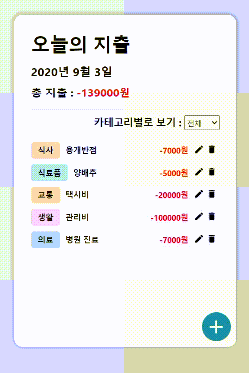

The project has implemented a spending list as a Toy project.

## Spending List

Spending List application made with React

## Library

```
$ yarn add styled-components
$ yarn add react-icons
```

```
$ yarn start
```

## Testing App


